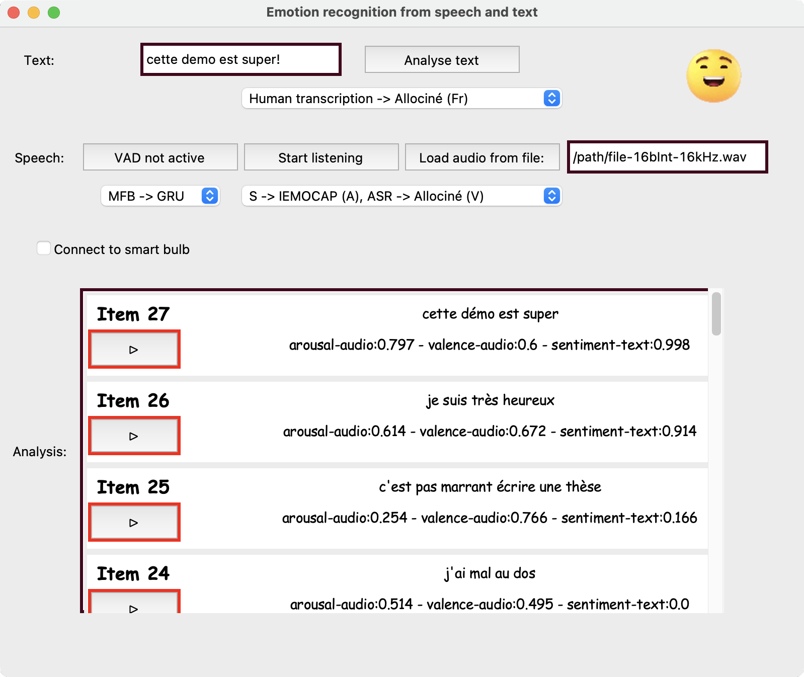

# Real-time Emotion Recognition from Speech and Text




The figure above shows the interface of the demo. The top part is the user interface area and the bottom part is the results of the analysis. At the top, the user can enter a text as input and hit analyse text to get a sentiment prediction (negative vs positive) on a range from zero to one. In addition, the user can also activate the VAD by clicking on the `VAD not active` button and then activate the microphone by clicking on `Start listening`. The programme will then automatically detect each time a phrase is spoken and make predictions based on the acoustic signal and the text applied to the output of Google's ASR model. As you can see in the figure, the default model selected is `S -> IEMOCAP, ASR -> Allociné`, which means that the model trained on the IEMOCAP dataset based on speech is used and the text predictions are based on a model trained on the Allociné dataset. The model trained on IEMOCAP can predict the arousal -activation- and valence -intrinsic pleasantness- dimensions of emotion (on a scale from zero to one), and therefore the output of the model in the `Analysis` section is also in the same format.


## Installation

Please follow the instructions below (depending on your machine, you might need to change some lines):

```bash
conda create -n "EmoDemo" python=3.8
conda activate EmoDemo
conda install -c anaconda pyaudio=0.2.11
pip install speechbrain==0.5.11
#conda install pytorch==1.10.2 torchaudio==0.10.2 -c pytorch
#conda install -c conda-forge transformers==4.16.2
pip install transformers==4.17
conda install -c conda-forge pydub=0.25.1

# pip install matplotlib==3.5.1
conda install -c anaconda scipy==1.7.3
pip install SpeechRecognition==3.10.0 # for google's speech recognition module
pip install -U scikit-learn
pip install python_speech_features

pip install tk # for the interface
pip install phue # for bulb activation
pip install Pillow # if u get the error: No module named 'PIL'

```

* This demo has been successfully tested on Ubuntu 18.4, Mac (Monterey with intel cpu), and Windows 11,

## Running the demo

In order to run the demo's interface, run:

```bash
conda activate EmoDemo
python Interface_bulb.py
```

